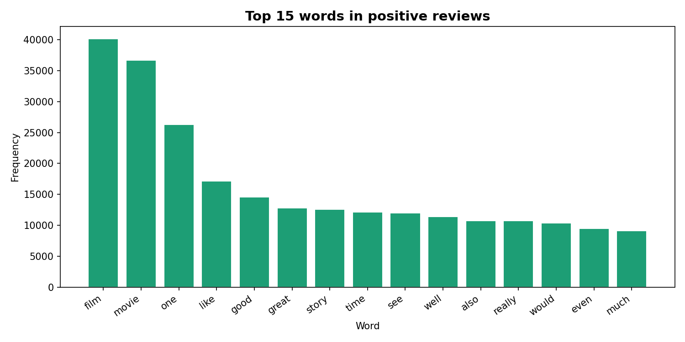

# AnalystLab Africa — AI Internship Program
### Week 1 & 2: Natural Language Processing (NLP) — IMDB Sentiment Analysis


---

## About This Project

This repository contains my work for **Week 1 & 2** of the AnalystLab Africa AI Internship Program.  
The goal was to explore **Natural Language Processing (NLP)** by cleaning and analyzing real-world movie reviews from the IMDB dataset.

The project focuses on preparing raw text data for machine learning by applying essential preprocessing techniques including text cleaning, tokenization, stopword removal, and word frequency analysis.

---

## Dataset

**IMDB Movie Reviews Dataset**

- 50,000 movie reviews
- 2 columns: `review`, `sentiment`
- Target column: `sentiment` (positive / negative)
- Balanced dataset (25,000 positive, 25,000 negative)

> **Note on Dataset Size:** To keep this repository lightweight and within GitHub file size recommendations, a cleaned sample of 5,000 reviews (`cleaned_imdb_sample.csv`) is included instead of the full processed dataset. [View Original Dataset on Kaggle](https://www.kaggle.com/datasets/lakshmi25npathi/imdb-dataset-of-50k-movie-reviews)

---

## What I Did

### 1. Data Cleaning

| Problem | Solution |
|---|---|
| HTML tags like `<br />` | Removed using regex |
| Numbers and punctuation | Removed |
| Mixed case text | Converted to lowercase |
| Extra spaces | Stripped |

**Result:** Clean, structured text ready for analysis.

---

### 2. Tokenization

Converted each review into individual words using NLTK:

`"I love this movie"` → `["i", "love", "this", "movie"]`

---

### 3. Stopword Removal

Removed common English filler words (e.g. "the", "is", "and", "a") to focus the analysis on words that carry actual meaning.

---

### 4. Word Frequency Analysis & Visualization

Analyzed the most common words in positive reviews and visualized the results.



Top words in positive reviews: **film, movie, great, story, love, best, excellent**

---

## Key Findings

### Dataset Balance
- Positive reviews: **50%** | Negative reviews: **50%**
- Perfectly balanced — no class imbalance issues for future modeling

### Text Cleaning Impact
- Removing stopwords reduced noise significantly
- Average review length reduced by ~40–50%

### Language Insights
- Positive reviews cluster around emotional and evaluative words: *"great", "love", "best", "excellent"*
- This word-level signal is a strong foundation for sentiment classification models

---

## Conclusion

This project demonstrates the importance of text preprocessing in NLP. Raw text data is messy and unstructured — after cleaning, tokenization, and stopword removal, the dataset becomes ready for machine learning.

**Next steps:** Build a sentiment classifier using Logistic Regression or Naive Bayes on this cleaned dataset to predict whether a review is positive or negative.

---

## Files in This Repository

| File | Description |
|---|---|
| `IMDB_NLP.ipynb` | Main Jupyter notebook for analysis |
| `imdb_summary.txt` | Written summary of insights |
| `chart_top_words.png` | Top 15 words visualization |
| `cleaned_imdb_sample.csv` | Sample cleaned dataset (5,000 reviews) |
| `requirements.txt` | Python dependencies |
| `README.md` | Project documentation |

---

## Getting Started

```bash
pip install -r requirements.txt
```

Then open `IMDB_NLP.ipynb` in Jupyter or Google Colab and run the cells in order.

---

## Tools Used

| Tool | Purpose |
|---|---|
| **Python 3.10** | Core programming language |
| **Pandas** | Data loading and manipulation |
| **NLTK** | Tokenization and stopword removal |
| **Regex** | HTML tag and punctuation cleaning |
| **Matplotlib** | Word frequency visualization |
| **Google Colab** | Development environment |

---

## About

**Intern:** Adekoya Kikelomo Akorede  
**Program:** AnalystLab Africa AI Internship  
**Week:** 1 & 2 — AI Foundations & Data Preparation  
**Focus:** Natural Language Processing (NLP)
